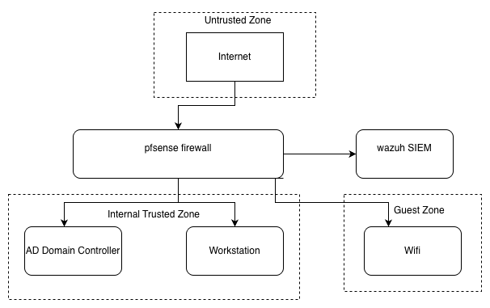

# Network Security Threat Model and Design Review

A design-stage STRIDE threat model and security design review of a small enterprise network.

## Overview

This project applies the STRIDE methodology to identify, rate, and recommend controls for security threats against a small enterprise network design. The environment consists of a pfSense firewall, a Windows Active Directory domain controller, domain-joined workstations, an isolated guest Wi-Fi segment, and a Wazuh server for centralised logging.

The review is performed at the design stage, before the system is built, which follows secure-by-design practice and allows weaknesses to be addressed before deployment. The recommended controls are to be validated in a lab implementation (see Next steps).

## Architecture

The network is segmented into trust zones. Traffic from the internet enters through the pfSense firewall, which acts as the gatekeeper between the untrusted internet and the internal network. Behind the firewall sits the internal trusted zone (domain controller and workstations). A separate guest zone hosts the family Wi-Fi, isolated from the internal zone. Wazuh collects logs from across the environment for monitoring and investigation.

## Methodology

STRIDE is applied to each component, examining six threat categories: Spoofing, Tampering, Repudiation, Information disclosure, Denial of service, and Elevation of privilege. Each threat is rated Low, Medium, or High, where risk reflects likelihood combined with impact.

## Key findings

- 27 threats identified across five components.
- Risk concentrates on the Active Directory domain controller (the crown jewel) and on the main entry points: the internet-facing firewall and the user workstation.
- Highest-priority risks are credential theft and privilege-escalation paths to the domain controller, malware delivery to workstations, and any weakness that breaks the isolation of the guest Wi-Fi from the internal network.

## Priority controls

- Enforce multi-factor authentication and a strong password and lockout policy, especially for domain administrators.
- Forward all logs to Wazuh so an attacker cannot erase evidence by clearing local logs.
- Isolate the guest Wi-Fi from the internal network with VLAN segmentation and firewall rules.
- Patch all systems, prioritising the firewall and domain controller.
- Restrict the firewall administration interface to the internal management network only.

## Repository contents

- `network-threat-model-dfd.drawio` - editable data flow diagram (draw.io)
- `network-threat-model-dfd.png` - exported diagram image
- `Network_Threat_Model_Report.pdf` - full report (read-only)
- `Network_Threat_Model_Report.docx` - full report (editable)

## Next steps

Build the environment in a lab (VirtualBox on a dedicated host), implement the recommended controls, and update the model with findings from the live environment, including verification that the guest Wi-Fi is isolated, that logs reach Wazuh, and that the firewall and domain controller are hardened and patched.

## Author

Akash Bhat - Melbourne, VIC
